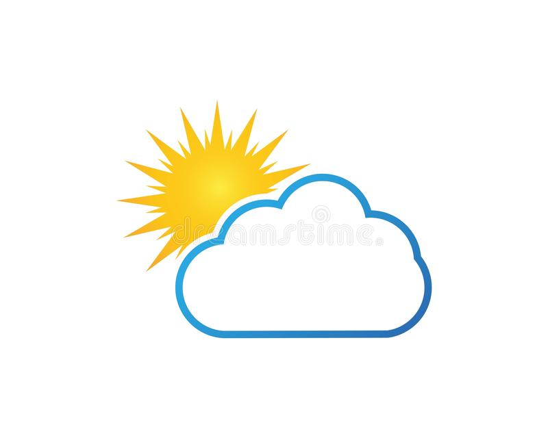

<!-- PROJECT SHIELDS -->
<!--
*** I'm using markdown "reference style" links for readability.
*** Reference links are enclosed in brackets [ ] instead of parentheses ( ).
*** See the bottom of this document for the declaration of the reference variables
*** for contributors-url, forks-url, etc. This is an optional, concise syntax you may use.
*** https://www.markdownguide.org/basic-syntax/#reference-style-links
-->
<!-- [![Contributors][contributors-shield]][contributors-url]
[![Forks][forks-shield]][forks-url]
[![Stargazers][stars-shield]][stars-url]
[![Issues][issues-shield]][issues-url]
[![MIT License][license-shield]][license-url]
[![LinkedIn][linkedin-shield]][linkedin-url] -->

<!-- PROJECT LOGO -->
 

    
  </a>

  <h3 align="center">Weather Data Visualized Website</h3>

  

    A website to display the Web Data Analysis and Visualizations generated from a prior project.
     
     

<!-- TABLE OF CONTENTS -->

  
<h2 style="display: inline-block">Table of Contents</h2>

  <ol>
    <li>
      <a href="#about-the-project">About The Project</a>
      <ul>
        <li><a href="#built-with">Built With</a></li>
      </ul>
    </li>
    </li>
    <li><a href="#usage">Usage</a></li>
    <!-- <li><a href="#roadmap">Roadmap</a></li> -->
    <!-- <li><a href="#contributing">Contributing</a></li>
    <li><a href="#license">License</a></li> -->
    <li><a href="#contact">Contact</a></li>
    <li><a href="#acknowledgements">Acknowledgements</a></li>
  </ol>

<!-- ABOUT THE PROJECT -->
## About The Project

The purpose of this project is to showcase my ability to create a website from scratch.  The content of this website is from a [weather analysis project](https://github.com/jdstrode/Visualizing-OpenWeather.com-API-Data) I completed previously.  The weather data was collected from [Openweather's API](https://home.openweathermap.org/users/sign_in) and the analysis was completed using Python, Pandas, and Matplotlib. 

### Built With

* [HTML](https://developer.mozilla.org/en-US/docs/Web/HTML)
* [CSS](https://developer.mozilla.org/en-US/docs/Web/CSS)
* [Bootstrap](https://getbootstrap.com/docs/4.1/getting-started/introduction/)
* [Python](https://docs.python.org/3/)
* [Pandas](https://pandas.pydata.org/pandas-docs/stable/index.html)

<!-- USAGE EXAMPLES -->
## Usage

The full webpage is deployed here: [Home Page](https://jdstrode.github.io/Web-Design-Challenge/WebVisualizations/index)

<!-- CONTRIBUTING
## Contributing

Contributions are what make the open source community such an amazing place to learn, inspire, and create. Any contributions you make are **greatly appreciated**.

1. Fork the Project
2. Create your Feature Branch (`git checkout -b feature/AmazingFeature`)
3. Commit your Changes (`git commit -m 'Add some AmazingFeature'`)
4. Push to the Branch (`git push origin feature/AmazingFeature`)
5. Open a Pull Request
 -->

<!-- LICENSE
## License

Distributed under the MIT License. See `LICENSE` for more information. -->

<!-- CONTACT -->
## Contact

J.D. Strode - [@Linkedin_Profile](https://www.linkedin.com/in/j-d-strode-1609867/) 

Project Link: [https://github.com/github_username/repo_name](https://github.com/github_username/repo_name)

<!-- ACKNOWLEDGEMENTS -->
## Acknowledgements

* [Northwestern University Data Science Bootcamp](https://bootcamp.northwestern.edu/data/landing/?s=Google-Brand&msg_cv_scta=4&msg_cv_stbn=1&msg_cv_fcta=1&pkw=northwestern%20data%20science%20bootcamp&pcrid=458379133811&pmt=e&utm_source=google&utm_medium=cpc&utm_campaign=GGL%7CNORTHWESTERN-UNIVERSITY%7CSEM%7CDATA%7C-%7COFL%7CTIER-1%7CALL%7CBRD%7CEXACT%7CCore%7CBootcamp&utm_term=northwestern%20data%20science%20bootcamp&s=google&k=northwestern%20data%20science%20bootcamp&utm_adgroupid=111164391830&utm_locationphysicalms=9021727&utm_matchtype=e&utm_network=g&utm_device=c&utm_content=458379133811&utm_placement=&gclid=CjwKCAjwzOqKBhAWEiwArQGwaPurKoj_Za8qBnj8iMwyUWXmOX6drbxgX_qyvbwhSus9g0WIM4mZbxoCC6AQAvD_BwE&gclsrc=aw.ds)

<!-- MARKDOWN LINKS & IMAGES -->
<!-- https://www.markdownguide.org/basic-syntax/#reference-style-links -->
<!-- [contributors-shield]: https://img.shields.io/github/contributors/github_username/repo.svg?style=for-the-badge
[contributors-url]: https://github.com/github_username/repo_name/graphs/contributors
[forks-shield]: https://img.shields.io/github/forks/github_username/repo.svg?style=for-the-badge
[forks-url]: https://github.com/github_username/repo_name/network/members
[stars-shield]: https://img.shields.io/github/stars/github_username/repo.svg?style=for-the-badge
[stars-url]: https://github.com/github_username/repo_name/stargazers
[issues-shield]: https://img.shields.io/github/issues/github_username/repo.svg?style=for-the-badge
[issues-url]: https://github.com/github_username/repo_name/issues
[license-shield]: https://img.shields.io/github/license/github_username/repo.svg?style=for-the-badge
[license-url]: https://github.com/github_username/repo_name/blob/master/LICENSE.txt
[linkedin-shield]: https://img.shields.io/badge/-LinkedIn-black.svg?style=for-the-badge&logo=linkedin&colorB=555 -->
<!-- [linkedin-url]: https://linkedin.com/in/github_username -->
